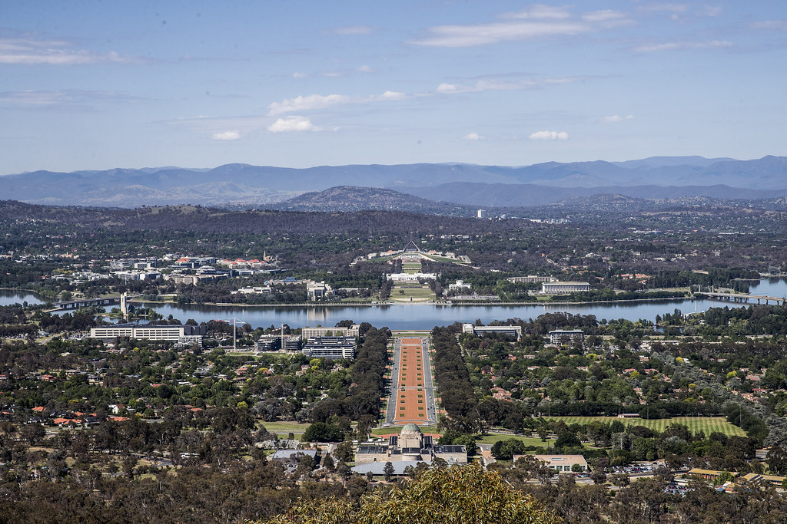
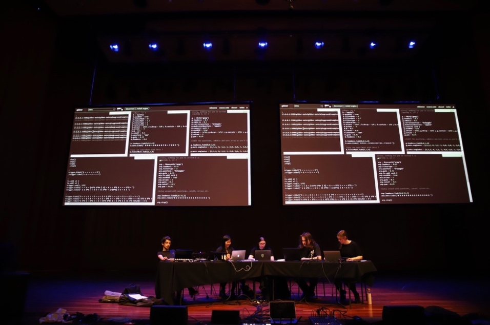
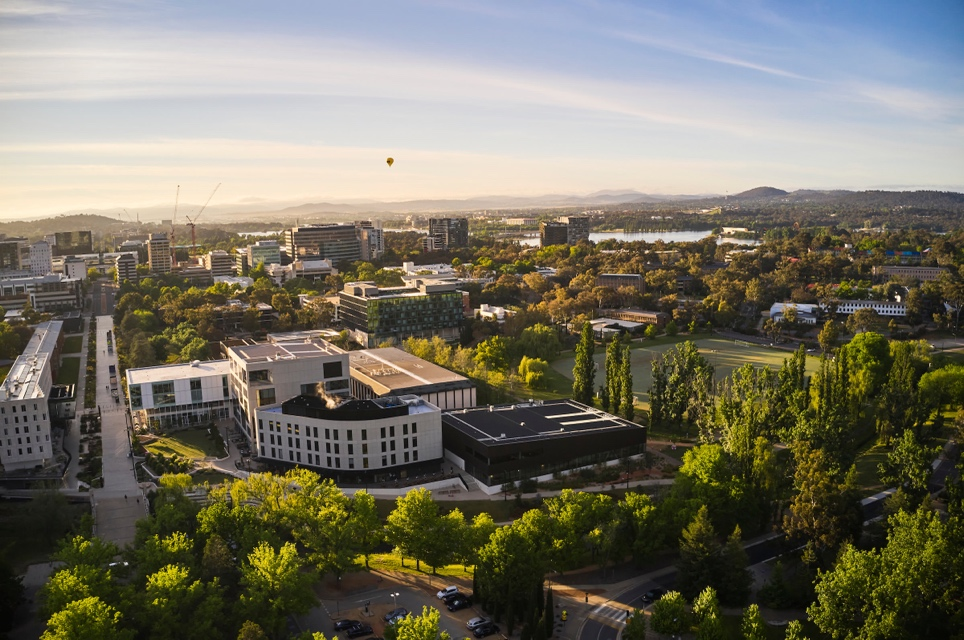

# NIME 2025 Hosting Proposal: Canberra, The Australian National University.

## Notes on this document

This is a slightly edited version of the real NIME 2025 proposal first submitted in mid-2023 to the (then) NIME steering committe.

This document represents an early version of what NIME2025 was going to look like, although we ended up following it closely in many aspects. The real NIME2025 program, team, and arrangements are in the [NIME2025 website](https://nime-conference.github.io/nime2025-website/).

A few items were removed from this version of the proposal, for instance, the proposed chair line up changed due to availability, biographies have been removed, and a reflections on the budget model from 2023 was removed as they were out of date with current expectations.

The main purpose of publishing this proposal is to assist future NIME organisers in planning their version of the conference, not to dictate all aspects of how NIME should be organised.

## Introduction

We propose that NIME2025 takes place in **Canberra, Australia**, hosted
at the **Australian National University.**

**Canberra** is a small but culturally energetic city holding many of
Australia's cultural institutions. The ANU has a history of engagement
with electronic and computer art and music through scholarship, artistic
fellowships, and education. The ANU is active in addressing important
social issues in Australia such as a commitment to below zero carbon
usage and engagement with and celebration of First Nations people.

The theme of NIME2025 will be ***­entangled NIME***. This theme
recognises the multilayered contexts of activity and impact involved in
music making with new technology.

We wish to host NIME to showcase the significant achievements of ANU
within NIME-related fields and to continue building a strong scholarly
computer music and art community in Australia. This is particularly
important for supporting Australian and New Zealand researchers and
artists who are young/emerging, historically disadvantaged, have a
disability, are First Nations people or who simply work outside of
academia and mainstream institutions. We feel that we can make an impact
on NIME by exposing the international community to our local scene as
well as use the conference to develop our ongoing practices and inspire
a new generation of students and artists.

To assist in including as many participants from the local community as
possible we will propose to host NIME directly after the Australasian
Computer Music Conference at ANU or a nearby institution.

## Carbon Negative

The ANU is committed to below zero carbon usage. To participate in this
commitment, we will take measures that reduce our carbon footprint such
as:

- Choosing venues with a sustainability commitment and within walking distance
- Choosing vegetarian catering
- No swag bags, merchandise limited to name tags.
- Using non-disposable crockery and cutlery where possible
- Encouraging reusable drink containers
- Providing hybrid options and high-quality digital resources in line with norms for post-COVID NIMEs

The organising team have experience running a carbon negative conference
(OzCHI 2022, Canberra) and feel that these measures are not in conflict
with a highly enjoyable and productive conference.

## Dates

We suggest **24-27 June 2025** (Tuesday through Friday). 24 June will be
a workshop and doctoral consortium day and the main conference program
will be over 25, 26, 27 June.

This timing avoids the teaching and exam periods at ANU and is just
before the typical winter school holidays in Australia. There are
limited venues available between 26 May and 13 June due to exams. The
period 30 June -- 20 July is school holidays and a peak travel time.

## Proposed Program

Day 1 (workshop and DC program):

- Workshops, tutorials and doctoral consortium
- (evening) welcome reception
- keynote concert

Day 2 (NIME program):

- Keynote 1
- Paper sessions
- Poster and demo session
- Evening concert
- Late night club concert

Day 3 (NIME program):

- Paper sessions
- Poster and demo session
- Lunchtime concert
- Conference dinner (booked through separate ticket)
- Late night club concert

Day 4 (NIME Program):

- Keynote 2
- Paper sessions
- Poster and demo session
- NIME town hall and closing session
- Evening concert
- Late night club concert

Day 5 (Social Program) Optional day trips:

- Walking in Tidbinbilla Nature Reserve
- Visit NASA's [Canberra Deep Space Communication
 Complex](https://www.cdscc.nasa.gov/Pages/opening_hours.html)
- Cultural walking tour of Canberra's National Gallery of Australia,
 Portrait Gallery, Questacon (Science Museum), National Museum of
 Australia, and Lake Burley Griffin
- Day walk to Black Mountain Tower and café crawl in Civic

## About Canberra and ANU

(ANZAC Avenue, Lake Burley Griffin, and Parliament House as seen from Mt
Ainslie. Image: ANU)

Canberra is the capital city of Australia and home to around 450,000
people. The city sits on the land of the
[Ngunnawal](https://www.ngunnawal.org/) and
[Ngambri](http://www.ngambri.org/index.html) Aboriginal people and we
acknowledge their elders past and present and unceded sovereignty.
Canberra is a planned city laid out in early 20^th^ century to include
significant areas of native bushland, parks, gardens and artificial
lakes. Canberra is home to Parliament House and many other national
institutions related to government, research and culture including the
National Gallery of Australia, National Library of Australia, National
Film and Sound Archive, the Commonwealth Scientific and Industrial
Research Organisation (CSIRO), and the Australian National University.

ANU was founded in 1946 and is the only university created by the
Australian Government. Originally a research institution, ANU now has
around 20,000 students. ANU has a strong focus on research excellence
and is frequently ranked among the top universities in the world. The
Canberra School of Music was founded in 1965 moving into a custom
designed building adjacent to ANU in 1976. In 1992 the School of Music
and School of Art became part of the ANU. The School of Music's
[Llewellyn Hall](https://www.llewellynhall.com.au/) is Canberra's
premier concert hall.

ANU has made historical impact in the field of electronic art and music.
In 1971, ANU hosted [Stan Ostoja
Kotkowski](https://adb.anu.edu.au/biography/ostojakotkowski-joseph-stanislaw--stan-21621),
a pioneer in electronic art, who created the Laser-Chromason performing
with composer Don Banks. In 1972, Banks and the Canberra School of Music
worked with [Tony Furse on the Qasar digital/analogue
synth](https://120years.net/qasar-iii-m8-tony-furse-australia-1970-1976/),
the direct ancestor to the Fairlight CMI. In 1989, the Australian Centre
for Arts and Technology (ACAT) was founded at ANU
([link](http://www.avatar.com.au/courses/acat/)). In 2001, the Peter
Karmel Building was opened at the ANU School of Music with studio
facilities for ACAT later known as PMA (Photography and Media Arts) at
the ANU School of Art and Design where the tradition of teaching and
researching electronic art, physical computing and [creative
coding](https://programsandcourses.anu.edu.au/2023/course/DESN2002)
continues.

Students from "Sound and Music Computing" Performing in Llewellyn Hall.
Image: Charles Martin

The ANU School of Computing has origins in courses dating back to 1971,
entering its current form in 2004 as the Research School of Computer
Science. In 2008, the School of Computing began teaching into the "New
Media Arts" programs within the humanities. This tradition has continued
with ["Art and Interaction
Computing"](https://comp.anu.edu.au/courses/comp1720/) continuing as a
popular first-year elective and a creative entry point into computing.
ANU was the home of the [Extempore live coding
language](https://github.com/digego/extempore) from 2012 to 2018 through
the work of Andrew Sorensen and Ben Swift. From 2018, Charles Martin,
Alexander Hunter, and Ben Swift taught computer music to music and
computing students through project courses as the "ANU Laptop Ensemble",
in 2023, Charles Martin started [Sound and Music
Computing](https://comp.anu.edu.au/courses/laptop-ensemble/), which is,
at 60 students, among the world's largest laptop ensemble courses.

In 2019, the [Kambri precinct and Cultural
Centre](https://kambri.com.au/venues/cultural-centre/) opened at ANU
including four flexible lecture/performance spaces, cafés and dining
venues, and state-of-the-art classrooms, teaching, and study spaces.
Kambri means "meeting place" to Aboriginal custodians of Canberra and is
the source of our city's name. As such, Kambri is an ideal centre to
hold NIME2025.

Recent relevant events at ANU include the Australasian Computer Music
Conference (ACMC) in 2020 (online), the Biennial Conference of the
International Association for the Study of Popular Music in 2019 and the
International Conference on Audio Display (ICAD) in 2016.

(ANU Kambri Precinct and Lake Burley Griffin. Image: ANU)

## Team

The proposed conference team is as follows (\* represents experienced
NIME author/organiser). We plan to directly recruit a second experienced
NIME contributor as a paper chair and run an EOI process to fill further
chair positions.

(Names removed for public version)

**Chairs:**

- **General Chairs:**
- **Paper Chairs:**
- **Proceedings Chair:**
- **Music Chairs:**
- **Demo/Poster Chairs:**
- **Installation Chairs:**
- **Workshop Chairs: (2 x chairs from EOI)**

**Support staff:**

- **Project Officer:** We will employ a local project officer for admin tasks in the weeks leading up to the conference and as a main point of contact for registrants during the conference. We will budget up to 150 hours for a casual/sessional role.
- **Technical Officers:**
- **Hybrid Conference Officers:** we will employ a technician to assist with hybrid aspects of the conference during paper sessions.
- **Volunteers:** We will aim to recruit up to 10 student volunteers to help with registration, concerts, and with roving microphones. A call for volunteers will go out through mailing lists and preference will be for students within NIME related programs or projects. We will aim to cover volunteer registration through sponsorship.

## Biographies

Removed for public version.

## Facilities

NIME2025 will be focussed on in-house facilities at the Australian
National University and adjacent cultural precincts.

We envision that the primary lecture venue will be the [Kambri Cultural
Centre](https://kambri.com.au/) which includes 700 and 200-seat lecture
theatres with retractable seats, a 300-seat cinema, a 150-seat black box
theatre and an attractive foyer. Kambri is the student centre of the
university and has many options for coffee, lunch, dinner, and
post-concert refreshments. The [Marie Reay Teaching
Centre](https://kambri.com.au/venues/marie-reay-teaching-centre/) has
ideal rooms for workshops between 30 and 120 participants.

Other associated venues may include: [The Street
Theatre](https://www.thestreet.org.au/) (4 minutes walk from Kambri)
comprising three spaces seating between 80-245, [Llewellyn
Hall](https://llewellynhall.com.au/venue-hire) (6 minutes walk), a
1335-seat classical concert hall, [Drill Hall
Gallery](https://dhg.anu.edu.au/) (4 minutes walk), [The Big Band
Room](https://services.anu.edu.au/campus-environment/facilities-maps/big-band-room)
(5 minutes walk), a 145-seat flexible concert venue, [Smiths
Alternative](https://www.smithsalternative.com/) (local music venue, 11
minutes walk), [Sideway](https://sidewaybc.com/) (local music venue, 14
minutes walk), [Ainslie Arts Centre](https://ainslieandgorman.com.au/)
(local music venue, 23 minutes walk), [The White Eagle
Club](https://www.polishclubcanberra.com.au/) (local music and dinner
venue, 20 minutes walk)

Our initial plan is that NIME2025 would work well centred around Kambri
with:

- Paper sessions in the Cinema (300 seats)
- Poster and demo sessions Cultural Centre Foyer
- Installations in Cultural Centre Foyer and Gallery
- Evening concerts in Kambri's T2 (200 seats), the Big Band Room (145
  seats), White Eagle Club (120 seats), or The Street Theatre (245
  seats).
- Late night concerts at the Big Band Room, Drill Hall Gallery, Smiths
  Alternative, Sideway, or Ainslie Arts Centre.

## Funding

Financial oversight will be provided by the ANU School of Computing. The
School of Computing has historically hosted small to medium sized
conferences at ANU venues including a yearly [Logic Summer
School](http://lss.cecs.anu.edu.au/) (LSS). We plan to apply similar
budget models and payment gateways from LSS to NIME2025 taking advantage
of existing staff expertise.

Our budget will focus on using university venues where these are
available discounted cost. Other significant costs are related to
personnel and equipment for everyday running of the conference and
particularly concerts. We would aim to keep registration costs
reasonable, particularly for students and artists, given the large cost
of international travel.

ANU School of Computing would make upfront payment of deposits to secure
venues and staff and will take financial responsibility for the
conference. Historically, ANU School of Computing has supported further
sponsorship of conferences specifically to fund student attendees.

We note that ANU has a [Below
Zero](https://www.anu.edu.au/research/research-initiatives/anu-below-zero)
commitment and as an ANU event we would expect to apply some level of
carbon auditing to NIME2025 and may purchase carbon offsets as part of
our budget.

We plan to open discussions with the following possible sponsor and
partners who have been involved in related events:

- Events Canberra (ACT Government)
- ArtsACT (ACT Government)
- Australia Council for the Arts (Australian Government)
- ANU College of Engineering, Computing and Cybernetics
- ANU College of Arts and Social Sciences (School of Music, School of Art and Design)
- ANU Maker Space
- The Street Theatre
- Ainslie and Gorman Arts Centres
- Belconnen Arts Centre

## Budget Estimate

The budget has been estimated to use low-cost institutional resources as
much as possible while being realistic with regards to costs of
technical assistance and acknowledging that labour from students and
assistants is often unpaid within a university.

We aim for a **budget margin of 20%.** This compares well to industry
standard for ACM conferences which are typically budgeted for a 31%
margin (16% service fee to ACM and 15% margin for emergent costs). In
our case, we do not have to pay an external service fee, but due to the
nature of NIME, we have a higher risk due to the **high fixed costs**
involved for concerts. An at-cost, or below-cost budget presents an
unacceptable risk to our institution and would not be supported. Income
above a 20% margin could be used to fund or support additional
activities in addition to those listed in this proposal.

Our budget includes income estimates for hybrid and in-person attendees.
We support hybrid attendance as a cost and carbon efficient option for
the community but feel that **remote attendees/presenters should pay the
same registration** as in-person NIMErs. This acknowledges that remote
attendees must contribute fairly to the fixed conference costs that make
NIME a significant cultural and scientific event. Conversely those
making financial sacrifice to attend in-person should not need to
subsidise remote presenters. Remote presenters also have significant
variable costs associated with arranging remote presentation (stream
management, rehearsal, communications, and decision making). The
organising team has significant experience (ACMC 2020, OzCHI 2022) in
presenting best-in-class remote and hybrid conferences.

Our pricing is based previous advertised NIME registration costs with:

- 20% discount for early bird registration
- 40% discount for student registration

The standard full price is set **at 700AUD (excl. 10% GST)** comparable
with NIME2023 and lower than NIMEs in previous high-cost countries.
(2023: 700AUD, 2021: (proposed) 715AUD, 2019: 667AUD, 2017: 931AUD).

We propose several initiatives to encourage diverse participation:

- Sponsored registration to encourage under-represented groups (in line
  with NIME diversity statement)
- Student discount offered to unaffiliated artists and participants from
  lower income countries.

Our budget estimates are based on a realistic goal of **150 paid
registrations**. This compares with NIME2023 Mexico (177 paid
registrations). We estimate a split of 75% in-person and 25% remote
attendees based on data from NIME2023.

In the following tables, a discount of 1 means 100% discount, 0.8 is 80%, 0 is no discount, and so on.

### Fixed Costs

| Description | Cost | Amount | Discount | Total |
|---|---|---|---|---|
| **Workshops + Doctoral Consortium** | | | | |
| ANU Classrooms (e.g., Kambri) | 0 | 0 | 1 | 0 |
| **Reception** | | | | |
| Welcome to Country | 300 | 1 | 1 | 300 |
| Bar Service | 44 | 4 | 1 | 176 |
| **Paper Sessions** | | | | |
| Kambri Cinema | 1650 | 3 | 0.8 | 3960 |
| Hybrid support | 44 | 24 | 1 | 1056 |
| **Poster Sessions** | | | | |
| Poster boards | 35 | 30 | 1 | 1050 |
| **Concerts** | | | | |
| Kambri T2 | 1100 | 3 | 0.8 | 2640 |
| Security | 65 | 12 | 1 | 780 |
| Lead sound technician | 100 | 18 | 1 | 1800 |
| Bar Service Staff | 44 | 12 | 1 | 528 |
| Ushers | 44 | 27 | 1 | 1188 |
| Hybrid support | 44 | 24 | 1 | 1056 |
| Kambri T2 PA + Lighting Allowance | 3300 | 3 | 1 | 9900 |
| Concert at AGAC | 1400 | 1 | 1 | 1400 |
| Concert at White Eagle | 2000 | 1 | 1 | 2000 |
| Algorave at Sideway | 1500 | 1 | 1 | 1500 |
| **Speakers** | | | | |
| Travel (International Speaker) | 3500 | 1 | 1 | 3500 |
| Travel (Local Speaker) | 750 | 1 | 1 | 750 |
| Accommodation | 200 | 8 | 1 | 1600 |
| Transit | 180 | 1 | 1 | 180 |
| Breakfast | 35 | 8 | 1 | 280 |
| **Software and Other** | | | | |
| Restream Professional | 500 | 1 | 1 | 500 |
| Web hosting | 300 | 1 | 1 | 300 |
| Design Work | 2000 | 1 | 1 | 2000 |
| **Total Fixed Expenses** | | | | **38444** |

### Variable Costs

Costs versus registrations at 75, 100, 150, 200 with 75% in person, 25%
remote.

| Description | Cost | % affected | 75 | 100 | 150 | 200 |
|---|---|---|---|---|---|---|
| reception catering | 50 | 75 | 2812.5 | 3750 | 5625 | 7500 |
| remote tech checks and management | 50 | 25 | 937.5 | 1250 | 1875 | 2500 |
| | | | **3750** | **5000** | **7500** | **10000** |

### Income

Registration fees at 75, 100, 150, 200 with 75% in person, 25% remote.
These pricing tiers could be adjusted to a residency-based model if this
continues with NIME2024.

| Registration Type | ex GST | Advertised | % Registration | 75 | 100 | 150 | 200 |
|---|---|---|---|---|---|---|---|
| Full Standard | 700 | 770 | 12.5 | 6300 | 8400 | 12600 | 17500 |
| Full Early | 560 | 616 | 25 | 10080 | 14000 | 20720 | 28000 |
| Student Standard | 420 | 462 | 12.5 | 3780 | 5040 | 7560 | 10500 |
| Student Early | 336 | 369.6 | 25 | 6048 | 8400 | 12432 | 16800 |
| Remote Full | 560 | 616 | 10 | 3920 | 5600 | 8400 | 11200 |
| Remote Student | 336 | 369.6 | 10 | 2352 | 3360 | 5040 | 6720 |
| Remote Hardship | 105 | 115.5 | 5 | 315 | 525 | 735 | 1050 |
| | | | **100** | **32795** | **45325** | **67487** | **91770** |

### Cost Breakdown

| Attendance | 75 | 100 | 120 | 150 | 200 |
|---|---|---|---|---|---|
| **Fixed Costs** | 38444 | 38444 | 38444 | 38444 | 38444 |
| **Variable Costs** | 3750 | 5000 | 6000 | 7500 | 10000 |
| **Income** | 32795 | 45325 | 55062 | 67487 | 91770 |
| **Final Position** | -9399 | 1881 | 10618 | 21543 | 43326 |
| **Margin %** | -22 | 4 | **24** | 47 | 89 |

On the current budget allowances, a 20% margin would be achieved with
attendance of around 120.